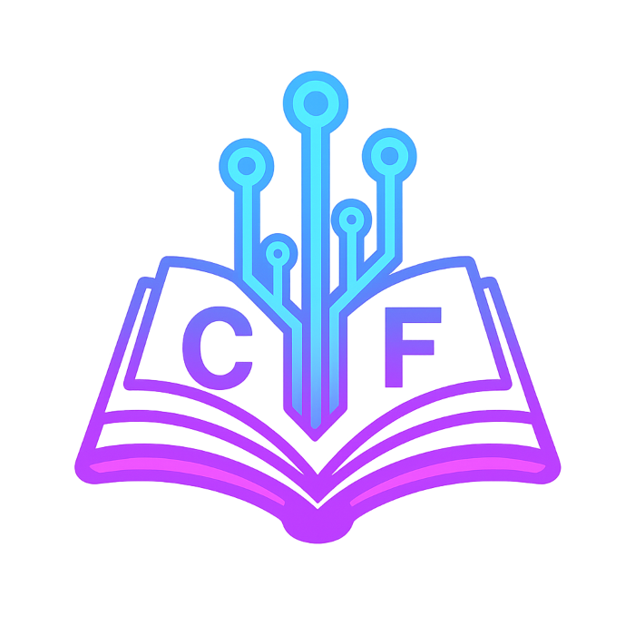

# Front-End Módulo 1

LINK PARA TESTE https://furiousofnight.github.io/front-end-modulo-1/

Bem-vindo ao projeto **Front-End Módulo 1**!  
Este repositório reúne páginas, exercícios, exemplos e recursos multimídia para estudo e prática de **desenvolvimento front-end**. O objetivo é facilitar o aprendizado com **navegação intuitiva, desafios práticos e materiais complementares**.

---

## 📂 Estrutura do Projeto

### Páginas Principais
- `index.html` – Introdução ao módulo e boas-vindas.
- `Fim-modulo.html` – Encerramento e conclusão do módulo.
- `indice-geral.html` – Índice geral para navegação entre as aulas.
- `politica.html` – Informações sobre política de uso.
- `sobre.html` – Detalhes sobre o projeto e autores.

### Exercícios e Treinamentos
O projeto conta com **27 aulas**, cada uma em seu próprio arquivo (`treiner-001.html` até `treiner-027.html`):

1. **Estrutura Básica do HTML**
2. **Bem-vindo ao seu primeiro HTML!**
3. **Aprendendo Parágrafos e Quebras de Linhas**
4. **Símbolos e Emojis no HTML**
5. **Direitos autorais e buscas de imagens**
6. **Tag de Imagens & Carga de Imagens**
7. **Mudando um favicon no HTML**
8. **Explicando Hierarquia de Títulos**
9. **Semântica no HTML5**
10. **Principais Formatações de Texto**
11. **Formatações adicionais em HTML**
12. **Outras formatações (Citações e códigos)**
13. **Listas OL e UL**
14. **Listas Mistas e Definições**
15. **Links e Âncoras em HTML**
16. **Usando links internos**
17. **Links Para Downloads**
18. **Proposta de desafio 1**
19. **Imagens Dinâmicas & Mídias em HTML5**
20. **Colocando áudio no site**
21. **Formatos de vídeos para sites**
22. **Vídeos em hospedagem própria**
23. **Incorporação de vídeos externos**
24. **Desafio - Um site com vídeos**
25. **Estilos Inline: explicação didática**
26. **CSS Interno/Local**
27. **Estilos CSS externos**

### Estilo
- `style.css` – Folha de estilos principal, responsável pela aparência das páginas.

### Imagens
- Pasta `imagens/` – Ícones, logos e imagens ilustrativas.

### Downloads
- Pasta `links-downloads/` – Materiais complementares em PDF e ZIP para download.

### Mídia
- Pasta `midia/` – Arquivos de áudio e vídeo para exemplos multimídia.
  - **Áudios:** `audio-02.mp3`, `audio-02.ogg`, `audio-02.wav`
  - **Vídeos:** `Patinho.mkv`, `patinho.mp4`, `patinho.ogv`, `Patinho.webm`

### Páginas Secundárias
- Pasta `secundarias/` – Notícias, estilos externos e conteúdos complementares.
  - `estilos-externos.html`
  - `noticias.html`
  - `secundaria-001.html` até `secundaria-004.html`

---

## ⚡ Como Utilizar

1. Abra os arquivos HTML em seu navegador para visualizar os exemplos e exercícios.
2. Explore as pastas de **imagens** e **mídia** para recursos visuais e sonoros.
3. Utilize os arquivos de **download** para obter materiais extras.
4. Navegue pelo **índice geral** para acessar rapidamente qualquer aula ou conteúdo.

---

## 🎯 Objetivo

Fornecer uma base prática e visual para iniciantes e revisores de conceitos de front-end.  
O projeto cobre desde a **estrutura básica do HTML** até o uso de **CSS externo**, passando por **multimídia, listas, links, desafios e boas práticas**.

---

## 🙏 Créditos

Desenvolvido por **FuriosOfNight**.  
Este projeto se baseia também no conteúdo do **Curso em Vídeo**, que ofereceu fundamentos importantes de HTML5 e CSS3.

[🎬 Acesse o Curso em Vídeo](https://www.cursoemvideo.com)  

Sinta-se à vontade para **sugerir melhorias**, **relatar problemas** ou **compartilhar o projeto**!
